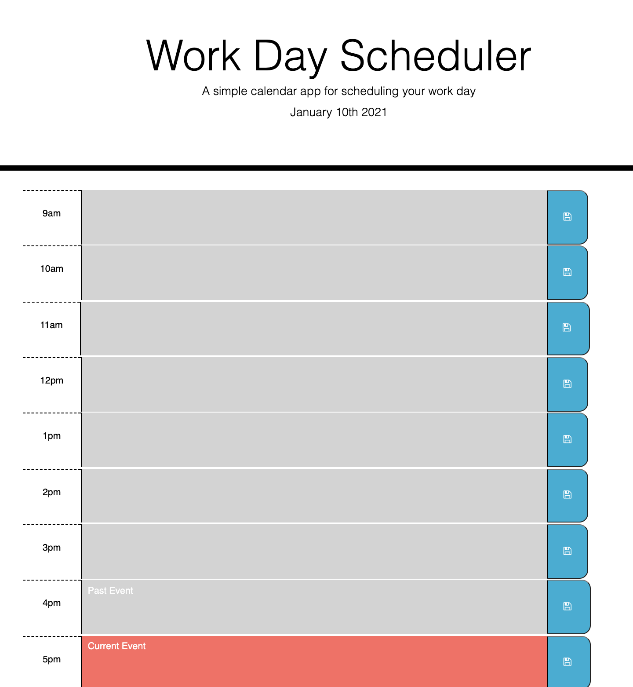

# workdayscheduler

## Description
This file creates a scheduler for the work day. The scheduler runs from 9am-5pm and allows you to write in events for each time period. The time period is then stored until it is manually cleared out. The scheduler also changes colors depending on the hour: for past events the row is grey, present the row is red, and future the panel is green.

## Link to Webpage
https://katemilano.github.io/workdayscheduler/

## Webpage Image 

## Contributors
Thanks to the instructors and teaching assistants at UNC Chapel Hill Bootcamp for making the creation of this webpage possible.

## Contact
If you have questions feel free to contact me at catherine.ann.milano@gmail.com.
